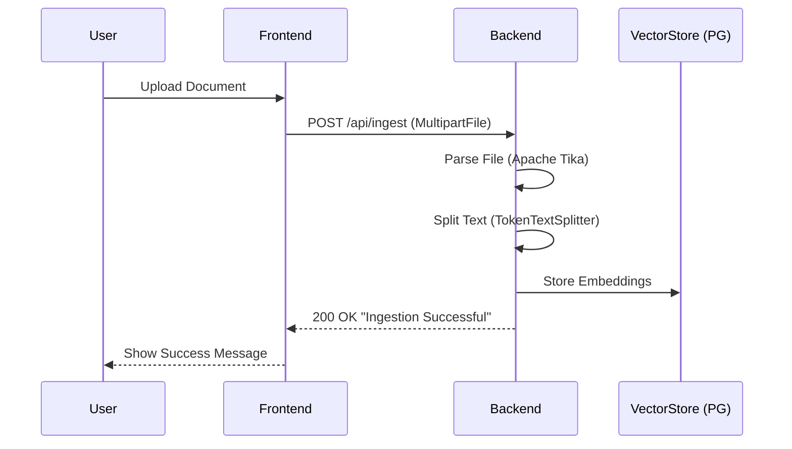
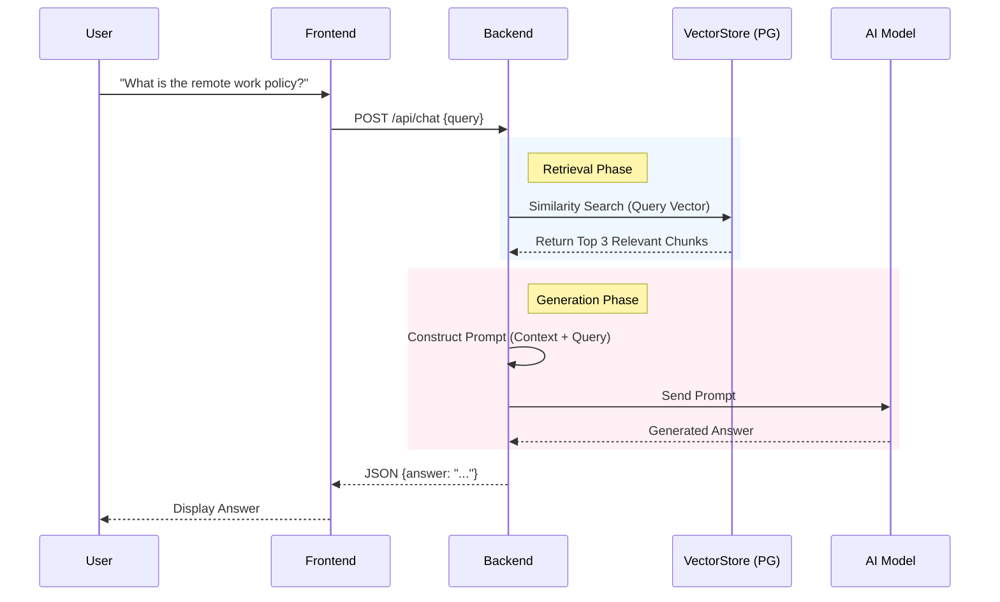

# Corporate Policy & Knowledge Assistant (RAG)

## 1. Project Summary
A full-stack Retrieval-Augmented Generation (RAG) application designed to streamline access to corporate knowledge. The system allows users to upload internal documents (PDFs, policies) and query them using natural language. Built with **Spring Boot** and **Spring AI** on the backend, it leverages **PostgreSQL with pgvector** for efficient vector similarity search. The frontend is a modern, responsive **React** application featuring a dark-mode chat interface. This project demonstrates the practical application of Generative AI to solve enterprise information retrieval challenges, ensuring accurate, context-aware responses by grounding LLM outputs in proprietary data.

## 2. Key Features & Highlights
*   **Spring AI Integration**: Seamlessly orchestrates LLM interactions and vector store operations.
*   **RAG Architecture**: Retrieves relevant context to ground LLM responses in facts.
*   **Vector Database**: Uses PostgreSQL with pgvector for high-performance similarity search.
*   **Document Ingestion**: Automated parsing and chunking of multi-format documents via Apache Tika.
*   **Modern Frontend**: React-based chat interface with real-time streaming-like experience.
*   **Scalable Design**: Containerized database and stateless backend services for easy scaling.
*   **Secure Data Handling**: Processes sensitive corporate data locally before vectorization.
*   **Context-Aware**: Retrieves top-k relevant document chunks for precise answer generation.

## 3. Detailed Technical Analysis & Flow Breakdown

### System Architecture

The application follows a classic 3-tier architecture enhanced with AI capabilities.

```mermaid
graph TD
    User[User] -->|Interacts| UI[React Frontend]
    UI -->|HTTP POST /chat| API[Spring Boot Backend]
    UI -->|HTTP POST /ingest| API
    
    subgraph "Backend Services"
        API -->|Delegates| Controller[RagController]
        Controller -->|Uses| Ingest[IngestionService]
        Controller -->|Uses| RAG[RagService]
        
        Ingest -->|1. Parse & Split| Tika[Apache Tika Reader]
        Ingest -->|2. Embed & Store| VectorDB[(PostgreSQL + pgvector)]
        
        RAG -->|1. Similarity Search| VectorDB
        RAG -->|2. Retrieve Context| VectorDB
        RAG -->|3. Construct Prompt| Prompt[System Prompt Template]
        RAG -->|4. Generate Answer| LLM[LLM Provider (OpenAI)]
    end
```

### Detailed Data Flow

#### A. Document Ingestion Pipeline
This process transforms raw files into searchable vector embeddings.

1.  **Upload**: User uploads a file (PDF, DOCX, TXT) via the React frontend.
2.  **API Endpoint**: The file is sent to `POST /api/ingest`.
3.  **Reading**: `TikaDocumentReader` extracts text content from the binary file format.
4.  **Splitting**: `TokenTextSplitter` breaks the continuous text into smaller, manageable chunks (tokens) to fit within the LLM's context window and improve retrieval precision.
5.  **Embedding & Storage**: These chunks are converted into vector embeddings and stored in the `vector_store` table in PostgreSQL.



#### B. Retrieval & Generation (Chat) Flow
This is the core RAG loop that answers user questions.

1.  **User Query**: User types a question (e.g., "What is the remote work policy?").
2.  **Similarity Search**: The backend converts the query into a vector and searches the PostgreSQL database for the top 3 most similar document chunks (`topK=3`).
3.  **Prompt Engineering**: A system prompt is dynamically constructed. It instructs the LLM to answer *only* using the provided context.
    *   *Template*: "You are a helpful assistant. Use the following information to answer the question..."
    *   *Context*: The text content from the retrieved database chunks.
4.  **LLM Inference**: The constructed prompt (System Instruction + User Query) is sent to the Chat Client (e.g., OpenAI API).
5.  **Response**: The LLM generates a natural language answer based on the retrieved facts, which is returned to the frontend.



### Technology Stack Details

| Component | Technology | Purpose |
| :--- | :--- | :--- |
| **Frontend** | React 19, Vite | Fast, reactive user interface. |
| **Styling** | Tailwind CSS | Modern, utility-first styling for a premium look. |
| **Backend Framework** | Spring Boot 3.2 | Robust Java-based REST API. |
| **AI Orchestration** | Spring AI | Abstraction layer for switching AI providers and managing vectors. |
| **Vector Database** | PostgreSQL + pgvector | Storing and querying high-dimensional vector data. |
| **Document Parsing** | Apache Tika | Extracting text from various file formats (PDF, DOC, etc.). |
| **Containerization** | Docker Compose | Orchestrating the database and application services. |
